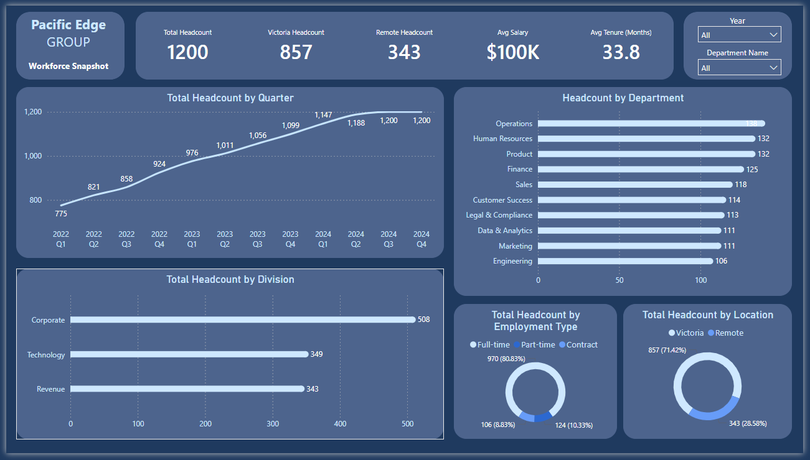
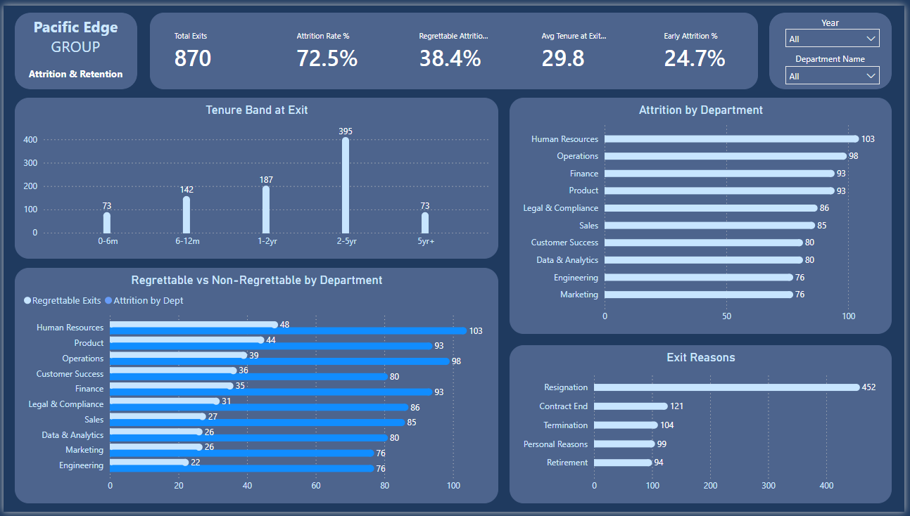
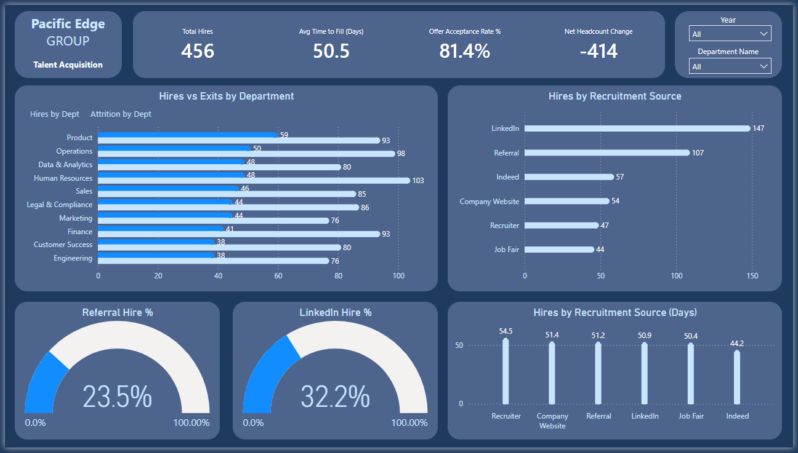
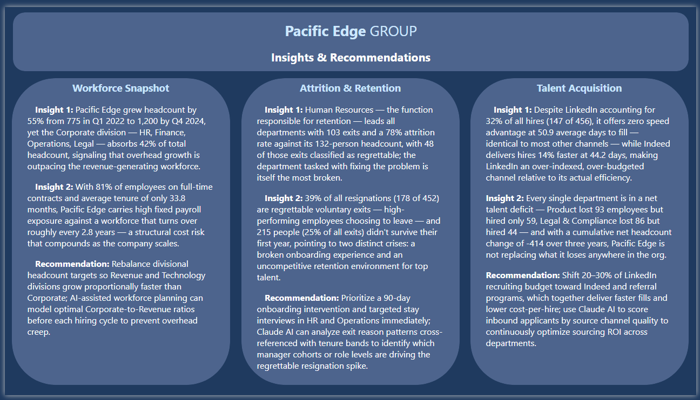

# 🧑‍💼 HR Analytics Dashboard

### Power BI · AI-Augmented · Pacific Edge Group

> End-to-end people analytics solution built with **Claude AI connected live to Power BI Desktop** via VS Code and the Power BI MCP server extension. Claude had direct read/write access to the semantic model — not a description of it, the actual model — and built alongside me the entire time.

---

## 🎬 AI Augmentation Demo

> A short demo showing Claude AI connected live to the Power BI Desktop file — reading the actual schema, generating dim_date, building the data dictionary, and creating this README automatically from live DAX query results.
>
> This is what AI augmentation looks like when the AI has real tool access instead of a chat window. No hallucinated column names. No broken DAX. Because it was querying the model, not guessing at it.

[](https://www.linkedin.com/feed/update/urn:li:ugcPost:7439409567463096320/)

<!-- ☝️ Replace the link above with your LinkedIn video post URL or YouTube link once uploaded -->

---

## Dashboard Preview

| Page                       | Preview                                                     |
| -------------------------- | ----------------------------------------------------------- |
| Workforce Snapshot         |  |
| Attrition & Retention      |          |
| Talent Acquisition         |              |
| Insights & Recommendations |                      |

---

## Overview

|                  |                                                                                               |
| ---------------- | --------------------------------------------------------------------------------------------- |
| **Domain**       | Human Resources / People Analytics                                                            |
| **Tools**        | Power BI Desktop · DAX · Power Query · Claude AI (MCP)                                        |
| **Dataset**      | Simulated HR data · Pacific Edge Group                                                        |
| **Date Range**   | January 2022 – December 2024                                                                  |
| **Employees**    | 1,200 across 10 departments                                                                   |
| **Report Pages** | 4 (Workforce Snapshot, Attrition & Retention, Talent Acquisition, Insights & Recommendations) |
| **DAX Measures** | 25 across 3 report domains                                                                    |

---

## Business Problem

HR leadership at Pacific Edge Group needed a single source of truth to answer:

1. **Why did attrition spike to 35.5% in 2024** — up from 21.7% the year before?
2. **Which departments are losing the most people** — and are those losses regrettable?
3. **Is hiring keeping pace with exits**, and where is recruitment most efficient?

---

## Key Findings

- **Attrition spiked from 21.7% → 35.5% in 2024** — a 13.8 percentage point jump in a single year
- **HR department had the highest attrition at 78%** — the team responsible for retention was itself the most at-risk, with 103 exits and 48 classified as regrettable
- **Net headcount loss of 414 over 3 years** — every single department ended up in a talent deficit
- **39% of resignations were regrettable voluntary exits** — high performers choosing to leave
- **LinkedIn accounts for 32% of hires but zero speed advantage** — Indeed fills roles 14% faster (44.2 vs 50.9 days)
- **Average salary held flat at ~$100K** — compensation is not the attrition driver

---

## Data Model

Star schema with 3 fact tables and 4 dimension tables. All relationships are active, Many-to-One, single direction.

```
                         dim_date (1,096 rows)
                              │
dim_employee ─────────────────┼──── fact_headcount  (36,322 rows)
dim_department ───────────────┼──── fact_attrition  (870 rows)
dim_role ─────────────────────┴──── fact_hiring     (456 rows)
```

### Tables

| Table            | Type      | Rows   | Grain                                   |
| ---------------- | --------- | ------ | --------------------------------------- |
| `fact_headcount` | Fact      | 36,322 | 1 row per employee per monthly snapshot |
| `fact_attrition` | Fact      | 870    | 1 row per exit event                    |
| `fact_hiring`    | Fact      | 456    | 1 row per hire event                    |
| `dim_employee`   | Dimension | 1,200  | 1 row per employee                      |
| `dim_department` | Dimension | 10     | 1 row per department                    |
| `dim_role`       | Dimension | 12     | 1 row per role                          |
| `dim_date`       | Dimension | 1,096  | 1 row per calendar day (2022–2024)      |

### dim_date

Calculated table built with `CALENDAR()` + `ADDCOLUMNS()`. Marked as Date Table. Includes 20 columns covering standard date attributes plus BC-specific columns: `is_bc_stat_holiday`, `is_working_day`, `fiscal_year`, `fiscal_quarter`, and `season`.

### Relationships

| From             | Column          | To               | Column          |
| ---------------- | --------------- | ---------------- | --------------- |
| `fact_headcount` | `date_key`      | `dim_date`       | `date_key`      |
| `fact_attrition` | `exit_date_key` | `dim_date`       | `date_key`      |
| `fact_hiring`    | `hire_date_key` | `dim_date`       | `date_key`      |
| `fact_headcount` | `employee_id`   | `dim_employee`   | `employee_id`   |
| `fact_headcount` | `department_id` | `dim_department` | `department_id` |
| `fact_headcount` | `role_id`       | `dim_role`       | `role_id`       |
| `fact_attrition` | `employee_id`   | `dim_employee`   | `employee_id`   |
| `fact_attrition` | `department_id` | `dim_department` | `department_id` |
| `fact_attrition` | `role_id`       | `dim_role`       | `role_id`       |
| `fact_hiring`    | `employee_id`   | `dim_employee`   | `employee_id`   |
| `fact_hiring`    | `department_id` | `dim_department` | `department_id` |
| `fact_hiring`    | `role_id`       | `dim_role`       | `role_id`       |

---

## DAX Measures — 25 Total

### Page 1 · Workforce Snapshot (7)

| Measure                | Description                                         |
| ---------------------- | --------------------------------------------------- |
| `Total Headcount`      | Total active employees in the latest snapshot month |
| `Victoria Headcount`   | Active employees based in Victoria                  |
| `Remote Headcount`     | Active employees in remote locations                |
| `Avg Salary`           | Average base salary across active employees         |
| `Avg Tenure (Months)`  | Average tenure in months for active employees       |
| `Total Payroll`        | Sum of all base salaries — total payroll exposure   |
| `Headcount MoM Change` | Month-over-month headcount change                   |

### Page 2 · Attrition & Retention (9)

| Measure                       | Description                                           |
| ----------------------------- | ----------------------------------------------------- |
| `Total Exits`                 | Total number of employee exits                        |
| `Attrition Rate %`            | Exits as a percentage of average headcount            |
| `Regrettable Exits`           | Exits marked as regrettable losses                    |
| `Regrettable Attrition %`     | Regrettable exits as % of total exits                 |
| `Avg Tenure at Exit (Months)` | Average tenure of employees at point of exit          |
| `Early Attrition (0-12m)`     | Exits within first 12 months — onboarding risk signal |
| `Early Attrition %`           | Early exits as % of all exits                         |
| `Attrition by Dept`           | Exit count filtered by department                     |
| `Resignation Rate %`          | Voluntary resignations as % of total exits            |

### Page 3 · Talent Acquisition (8)

| Measure                   | Description                                     |
| ------------------------- | ----------------------------------------------- |
| `Total Hires`             | Total number of hires in selected period        |
| `Avg Time to Fill (Days)` | Average days from job open to offer accepted    |
| `Offer Acceptance Rate %` | Percentage of offers that were accepted         |
| `Net Headcount Change`    | Hires minus exits — net workforce change        |
| `Hires by Dept`           | Hire count filtered by department               |
| `Hiring vs Attrition Gap` | Negative = org is shrinking; positive = growing |
| `LinkedIn Hire %`         | Share of hires sourced from LinkedIn            |
| `Referral Hire %`         | Share of hires sourced via referral             |

---

## AI Augmentation

This project was built with **Claude AI connected live to Power BI Desktop** via the Power BI MCP (Model Context Protocol) server extension in VS Code.

Claude had direct read/write access to the semantic model throughout the build — not a description of it, the actual live model. This enabled:

- **Schema validation before every DAX measure** — column names confirmed via MCP before any code was written
- **dim_date generated in one shot** — 20 columns, YYYYMMDD integer key, marked as Date Table, BC stat holidays included
- **All 12 relationships created programmatically** — fact-to-dimension, Many-to-One, validated and refreshed
- **Data dictionary auto-generated** — 120-row `_Data Dictionary` calculated table documenting every table, column, and measure inside the model
- **This README written automatically** — generated by running live DAX queries against the model and embedding the real numbers

MCP gives AI structured, live tool access — not a chat window. That's the difference.

---

## How to Open

1. Clone or download this repository
2. Open `hr-analytics.pbix` in **Power BI Desktop**
3. The model uses imported data — no credentials or gateway required
4. All 4 report pages load automatically with Year and Department Name slicers

---

## Repository Structure

```
hr-analytics/
├── hr-analytics.pbix              # Power BI report and semantic model
├── README.md                      # This file
├── screenshots/
│   ├── 1-workforce-snapshot.png   # Page 1 — Workforce Snapshot
│   ├── 2-attrition-retention.png  # Page 2 — Attrition & Retention
│   ├── 3-talent-acquisition.png   # Page 3 — Talent Acquisition
│   └── 4-insights.png             # Page 4 — Insights & Recommendations
└── docs/
    └── data-dictionary.docx       # Full data dictionary (tables, columns, measures)
```

---

## Author

**Tural Mansimov** — Data Analyst, Victoria BC

[](https://linkedin.com/in/tural-m)
[](https://github.com/tural-m)
[](https://www.tural.ca)

---

_Built with Power BI · DAX · Power Query · Claude AI (MCP)_
